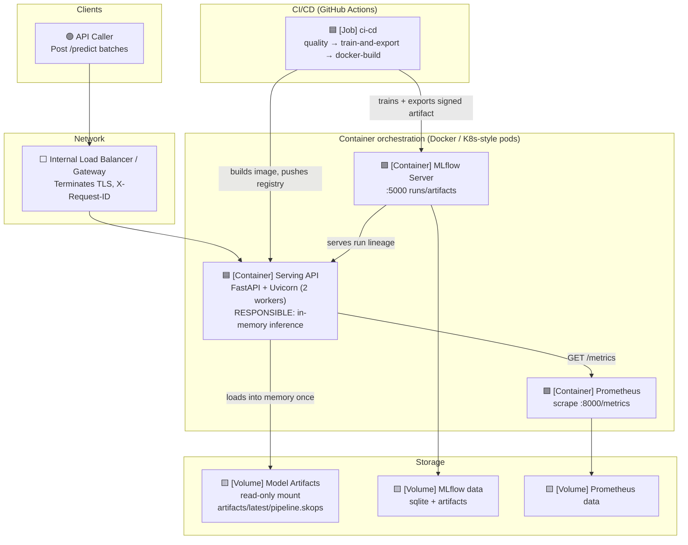
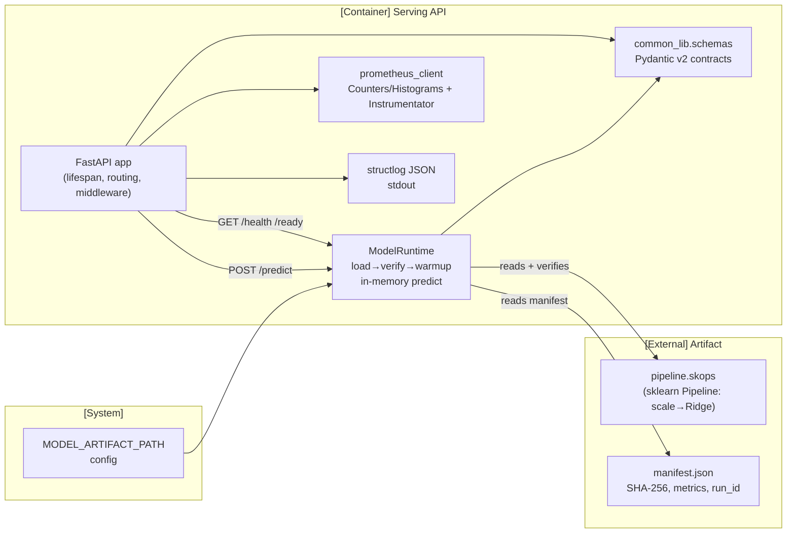
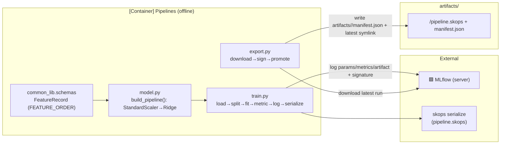

# High-Level Design (C4 Level 2) — Containers & Components

This is the principal design document. It describes the container topology,
component responsibilities, deployment models, and the primary data flows.

---

## 1. Container Diagram

Four deployable units plus the CI runtime:



At runtime the **API container** is the only always-on component; MLflow and
Prometheus are supporting services (long-lived in the reference stack).

---

## 2. Component Diagram — Serving API

Internal structure of the API container:



### Component Responsibilities

| Component | Responsibility | Key detail |
|---|---|---|
| `main.py` (FastAPI) | HTTP interface, lifecycle, request-ID propagation, route-level metrics | Lifespan loads model once; boot is **tolerant** of missing artifact (readiness 503) |
| `runtime.py` (ModelRuntime) | Load artifact, validate integrity, warm-up, batch predict | `skops` deserialization with `_TRUSTED_TYPES` allow-list; warmup catches train/serve skew |
| `schemas.py` | Canonical contracts | `FeatureRecord`, `PredictionRequest/Response`, `HealthResponse`; `extra="forbid"`, strict floats, range bounds |
| `Instrumentator` | Per-route HTTP metrics | Groups status codes, ignores untemplated paths |
| `structlog` | Structured JSON logging | Single-line records, `service` field, ISO timestamps UTC |
---

## 3. Component Diagram — Pipelines



---

## 4. Deployment Topologies

### 4.1 Local Development (docker-compose reference stack)

`make stack-up` runs three containers: `api`, `mlflow`, `prometheus` with
named volumes. The API mounts `../artifacts:/models:ro`.

```
┌─────────────┐   ┌──────────────┐   ┌──────────────┐
│ api:8000    │ → │ mlflow:5000  │   │ prometheus    │
│ (artifacts)->/models:ro        │   │ scrapes api   │
└─────────────┘   └──────────────┘   └──────────────┘
```

### 4.2 Production target (conceptual)

- **Serving:** replicated API pods behind a load balancer / service mesh
  (e.g. Kubernetes `Deployment`, `HorizontalPodAutoscaler`), TLS terminated
  at the gateway.
- **Readiness/liveness:** `/ready` (503 until model warm) drives readiness
  probe; `/health` drives liveness.
- **Artifact distribution:** CI exports the signed artifact and mounts it into
  new pods **read-only** via a projected volume / init-container at deploy
  time (not live-updated in place) — keeping immutability of serving pods.
- **Observability:** Prometheus pulls `/metrics`; alerts defined in
  [observability](../operations/observability.md).
- **Model update flow:** atomic via symlink swap (`artifacts/latest`) or new
  pod rollout; see [deployment](../operations/deployment.md).

### 4.3 Scaling behaviour

- **Stateless** inference workers — horizontal scale is trivial.
- Artifact loaded once per process; memory = artifact working set + overhead.
- Batch size is bounded (1–1024 records) to protect memory/latency.
- `deploy.resources.limits` (cpus 2.0, memory 1G) set in compose as a guard.

---

## 5. Data / Control Flow Summary

| # | Flow | Path | Async? |
|---|---|---|---|
| 1 | Train | `main → load_data → train → MLflow (fallback sqlite) → skops dump` | No |
| 2 | Export | `export → MLflow download → manifest(SHA-256) → latest symlink swap` | No |
| 3 | Serve startup | `lifespan → resolve path → load → verify → warmup → set_runtime` | No |
| 4 | Predict request | `POST /predict → validate → records_to_matrix → predict → metrics → response` | No |
| 5 | Observability | `request → Instrumentator + counters → /metrics scrape` | Async pull |

---

## 6. Failure Semantics (summary)

| Failure | Symptom | Behaviour |
|---|---|---|
| Artifact missing | `FileNotFoundError` at startup | App **boots**; `/ready` 503; `/predict` 503; `/health` `not-ready` |
| Artifact tampered | SHA-256 mismatch | `ArtifactIntegrityError`; boot fails (kept out of LB) |
| Artifact wrong shape | Warmup predict fails | `ArtifactIntegrityError`; boot fails — prevents train/serve skew silently |
| MLflow down at train | `ConnectionError` | Train exits 1 unless `--allow-fallback` → sqlite |
| Malformed request | 422 (Pydantic) | Client error, no inference |
| No model loaded (after reset) | `ModelNotLoadedError` | 503 |

See [Runbook](../operations/runbook.md) for diagnosis steps.

---
*Next: [Sequence Flows](sequence-flows.md)*
| `Dynaconf config` | Config layering | `APP_*` env beats `settings.toml`; optional file, never fatal |