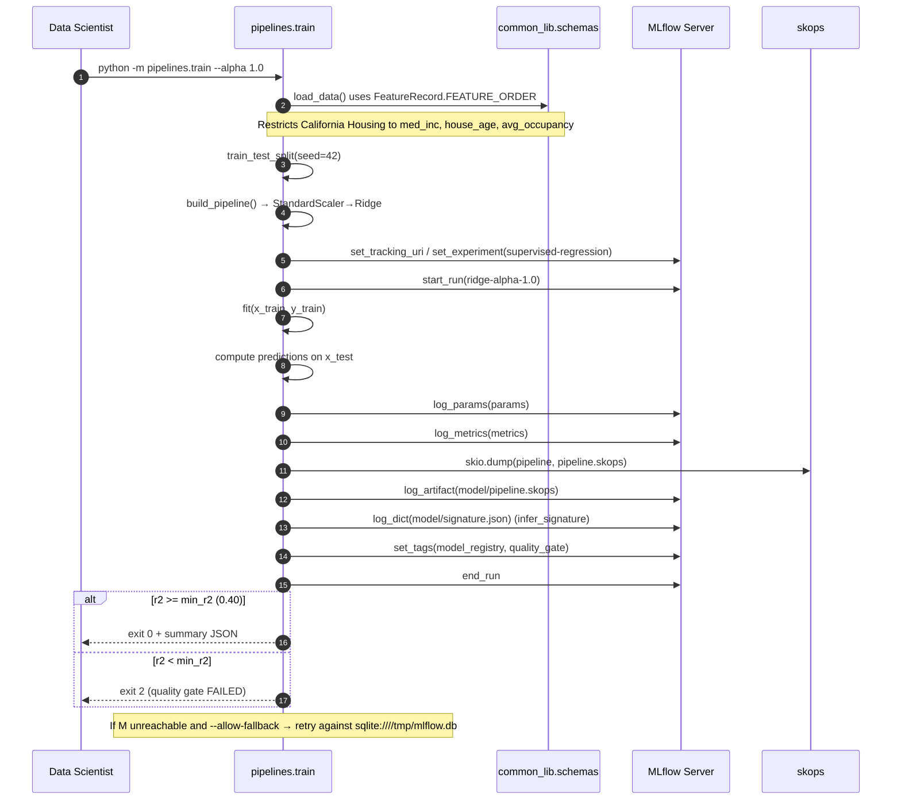
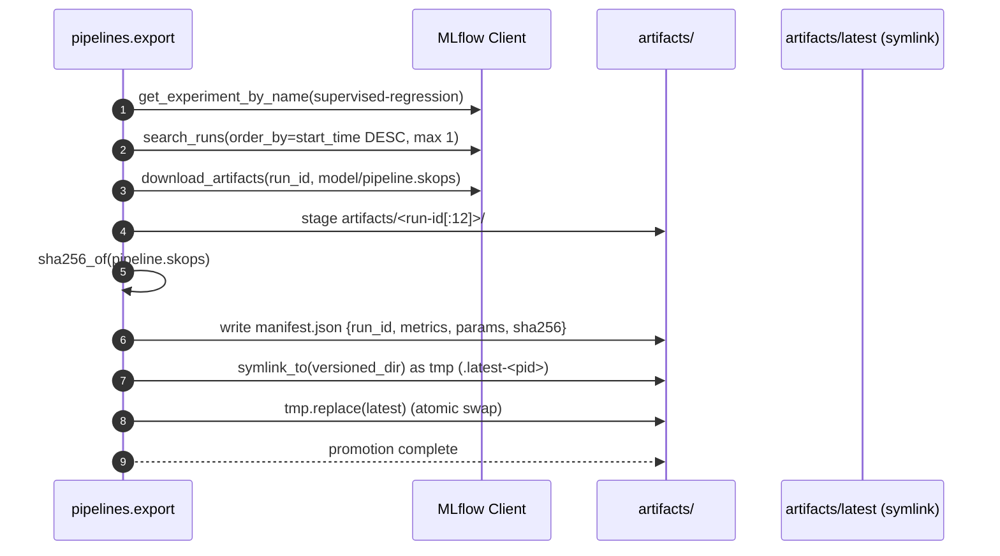
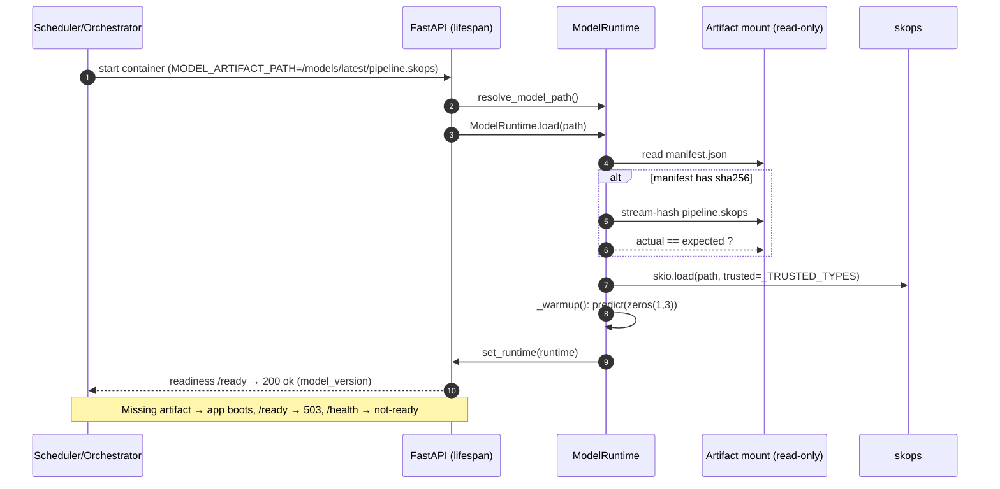
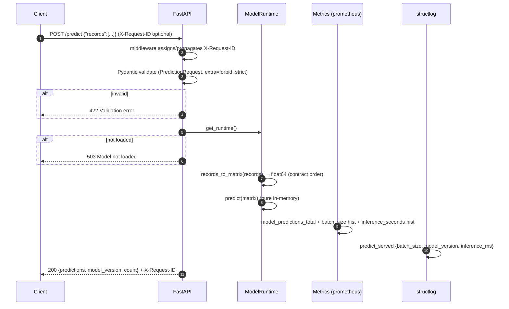
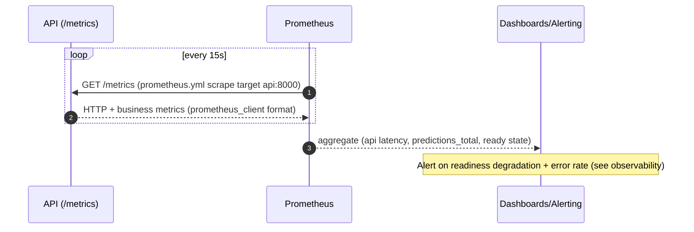

# Sequence Flows — End-to-End

The complete lifecycle, rendered as sequence diagrams. Covers the three
offline stages plus the online inference and observability paths.

---

## 1. Training

**Exit codes:** `0` pass · `1` infra/error · `2` quality gate fail.

---

## 2. Export (sign + promote)

**Property:** the `latest` symlink swap is atomic-ish on POSIX, so a serving
process mounted at `artifacts/latest` never reads a half-written target.

---

## 3. Serving API — Startup & Readiness

---

## 4. Online Prediction

---

## 5. Observability

**Per-route HTTP metrics** come from `prometheus-fastapi-instrumentator`
(status-code grouped); **business metrics** from `prometheus_client`
(`model_predictions_total`, `model_prediction_batch_size`,
`model_inference_seconds`).

---
*Next: [Data Contracts](data-contracts.md)*