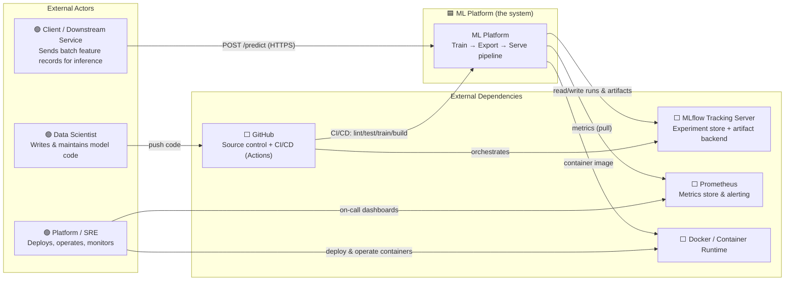

# System Context Diagram (C4 Level 1)

The **ML Platform** is an enterprise MLOps monorepo that serves supervised
regression predictions over HTTP with a fully tracked, quality-gated and
integrity-verified model lifecycle. This is the highest-level view: the
system as a single box with its external dependencies.

## Key Facts

- **Purpose:** Serve low-latency batch regression predictions with
  reproducible, auditable training.
- **Primary callers:** Downstream services (machine-to-machine, HTTPS).
- **Runtime tech:** Python 3.12, FastAPI + Uvicorn, scikit-learn (Ridge +
  StandardScaler), NumPy, `skops` serialization, Prometheus instrumentation.
- **Model:** California Housing regression restricted to 3 canonical features
  (`med_inc`, `house_age`, `avg_occupancy`).
- **Not in scope:** No UI, no authN/authZ of callers (service-to-service on an
  internal network — see [Security](security.md)), no multi-model registry
  routing, no online feature store.

## External Dependency Contracts

| Dependency | Interaction | Failure mode | Mitigation |
|---|---|---|---|
| GitHub | Push code; CI/CD triggers on `main` | CI unavailable → no deploy | Branch protection gating |
| MLflow | Log runs, metrics, artifacts; download artifact at export | Server down → training falls back to local sqlite (`--allow-fallback`) | Fallback URI, offline artefact export |
| Prometheus | Pulls `/metrics` every 15s | Metrics gap → degraded observability only (non-critical path) | Redundant scrape target |
| Docker | Image build & runtime | — | Multi-stage, non-root, healthcheck |

## Explicit Dependencies the System Does NOT Own

- **MLflow server** and **Prometheus** are independently operated;
  `docker-compose` provides a local reference implementation.
- The model artifact **source of truth** is the MLflow artifact backend; the
  `artifacts/` directory is a derived, signed promotion copy.

---
*Next: [High-Level Design](hld.md)*