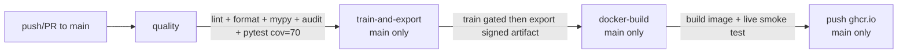
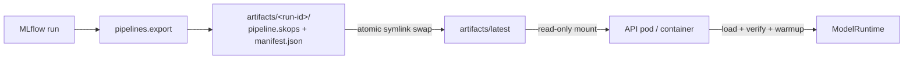

# Deployment

This document defines how the system moves from commit to production and how
artifacts are promoted. It distinguishes **what is implemented today**
(`docker-compose` reference stack + CI) from the **production target model**.

## 1. Deployment pipeline (CI — GitHub Actions)

`.github/workflows/ci.yml` `ci-cd` workflow, `push`/`PR` on `main`:

| Job | Runs | Gate |
|---|---|---|
| `quality` | Always | ruff, ruff format, mypy strict, pip-audit, pytest `--cov-fail-under=70` |
| `train-and-export` | main only (`needs: quality`) | Train with `--min-r2`; export signed artifact; `upload-artifact` (retention 30d) |
| `docker-build` | main only (`needs: train-and-export`) | Builds multi-stage image; downloads artifact; smoke-test (ready + predict + non-root `10001`); pushes on main |

> **Promotion policy:** only a green `quality` and a passing
> `train-and-export` (quality gate) can build/promote a serving image. Branch
> protection should require `quality` to merge to `main`.

## 2. Environments

| Env | Provisioning | Serving | Artifact source |
|---|---|---|---|
| Dev/Local | `make stack-up` (compose) | API :8000, MLflow :5000, Prometheus :9090 | `artifacts/latest` bind-mount `:ro` |
| Staging (target) | K8s namespace | API deployment + LB, readiness probe | Signed artifact projected at deploy |
| Production (target) | K8s namespace + service mesh | Replicated API, HPA | Immutable, versioned artifact per release |

`settings.toml` carries `[development]` / `[production]` layered config
(Dynaconf, `APP_*` env overrides) so one image runs everywhere.

## 3. Serving image (Container)

- File: `infrastructure/Dockerfile` (multi-stage; see ADR-0008).
- Tag: `ml-platform/api:1.0.0` (local), `ghcr.io/<owner>/api:<sha>` (CI).
- Runs non-root `10001:10001`, `HEALTHCHECK` to `/health`, uvicorn 2 workers.
- `MODEL_ARTIFACT_PATH` default `/models/pipeline.skops`; compose overrides to
  `/models/latest/pipeline.skops` with `../artifacts:/models:ro`.

## 4. Model deployment / promotion

- **Release unit:** a versioned `artifacts/<run-id>/` dir + its `manifest.json`.
- **Promotion:** `pipelines.export` writes the versioned dir and atomically
  swaps `latest`.
- **Serving deploy:** containers load the promoted artifact at boot; pod
  rollout is immutability-first (artifacts bundled/projected with the deploy).
- **Rollback:** repoint `latest` (see [runbook §8](runbook.md)) and restart, or
  roll back the release.

## 5. Configuration management

- Config resolved in 12-factor order: `APP_*` env **wins** → `settings.toml`
  → defaults (Dynaconf in `common_lib.config`).
- `settings.toml` is **optional**; containers carry no repo checkout.
- Secrets must be injected via the environment/secrets manager — never in
  git. See [security](../architecture/security.md).

## 6. Scaling & capacity

- Stateless workers: scale horizontally; HPA on `http_requests_per_second` /
  CPU.
- `resources.limits` (cpus 2.0, memory 1G) per container in compose as a guard.
- Batch bounded 1–1024 to protect memory/latency.
- Scale the model re-load as a **one-time per-pod cost**, not per-request.

## 7. Zero-downtime deployment strategy (target)

1. Build new image + promote new signed artifact.
2. Roll out with readiness gates (`/ready`), rolling update / blue-green.
3. New pods verify `/ready` before taking traffic; old pods drain.
4. Confirm `/ready` → `model_version` == new `run_id[:12]`; then canary traffic.
5. On failure: rollback (see runbook §8) before old pods scaled down.

## 8. Release checklist (pre-prod)

- [ ] CI green: `quality`, `train-and-export`, `docker-build` with smoke test
- [ ] Quality gate passed for promoted run; `manifest.json` has valid SHA-256
- [ ] `/ready` returns `status: ok` with the expected `model_version`
- [ ] Metrics flowing (`/metrics`, `model_predictions_total` populated)
- [ ] Rollback path rehearsed (repoint `latest`, restart)
- [ ] Runbook owners on-call; alerts configured

---
*Next: [Security](../architecture/security.md)*